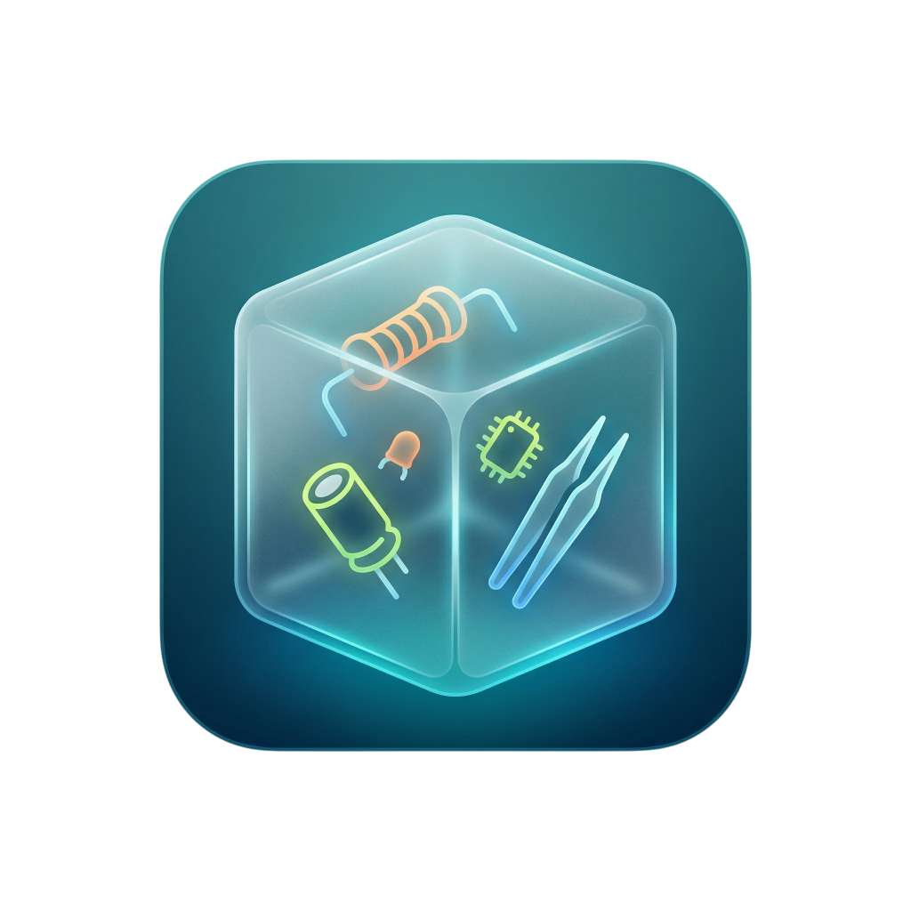

<div align="center">
  <br />
  
  <h1>📦 ThingBox</h1>
  <br />
</div>

<br />

ThingBox is a fast, lightweight, and modern open-source inventory management system designed specifically for electronics labs, maker workshops, university labs, and engineering teams. With its clean glassmorphism UI and fast API, it helps you effortlessly track your electronics components, fixtures, tools, and project-based material consumptions.

## ✨ Features

- 🗄️ **Hierarchical Locations & Categories:** Infinite nesting capabilities (e.g., *Electronics Cabinet > Second Drawer > Left Box*).
- 🔧 **Fixture & Tool Tracking:** Monitor your permanent tools, devices, their models, serial numbers, and physical locations.
- 🔋 **Consumable Materials:** Track components, sensors, and stock counts.
- 🎯 **Project Management Lifecycle:** Transfer raw materials to temporary projects, monitor quantities used purely in the field, return remaining components to the depot, or permanently send them to the "Consumption Archive".
- 📜 **Detailed Audit Logs:** Auto-generated footprint logging for every CRUD operation (who, what, and where).
- 🆔 **Unique Hash IDs:** Auto-generated, highly readable, printable short IDs for every hardware piece (`#A1B2E3`) to pair with physical labeling.
- ⚡ **Modern Stack:** React 19, Next.js App Router, Prisma ORM, and custom CSS variables for ultra-fast rendering with zero bloated UI frameworks.

## 🚀 Quick Start

### Prerequisites
- Node.js (v18+)

### Installation

1. Clone the repository
```bash
git clone https://github.com/yourusername/ThingBox.git
cd ThingBox
```

2. Install dependencies
```bash
npm install
```

3. Database Setup (SQLite by default)
```bash
npx prisma generate
npx prisma db push
```

4. Start the Application
```bash
npm run dev
```
Visit `http://localhost:3000` to start using your local ThingBox. Enjoy!

---